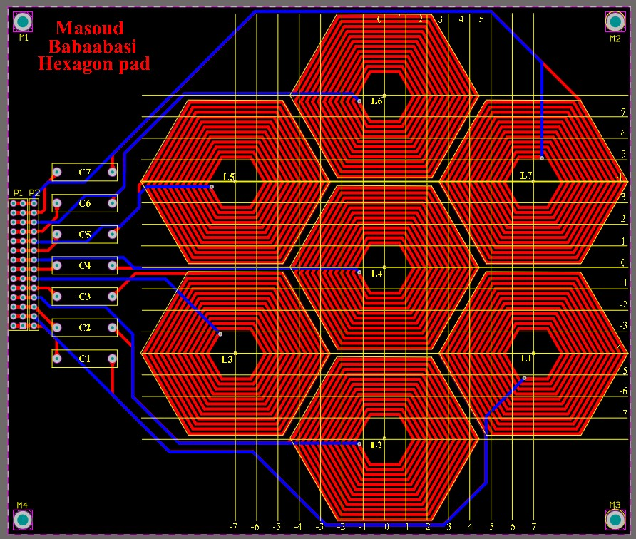
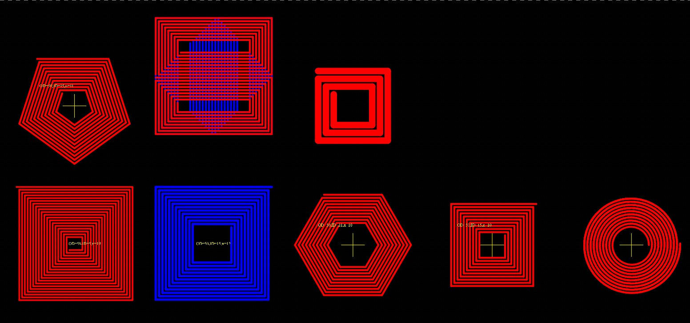
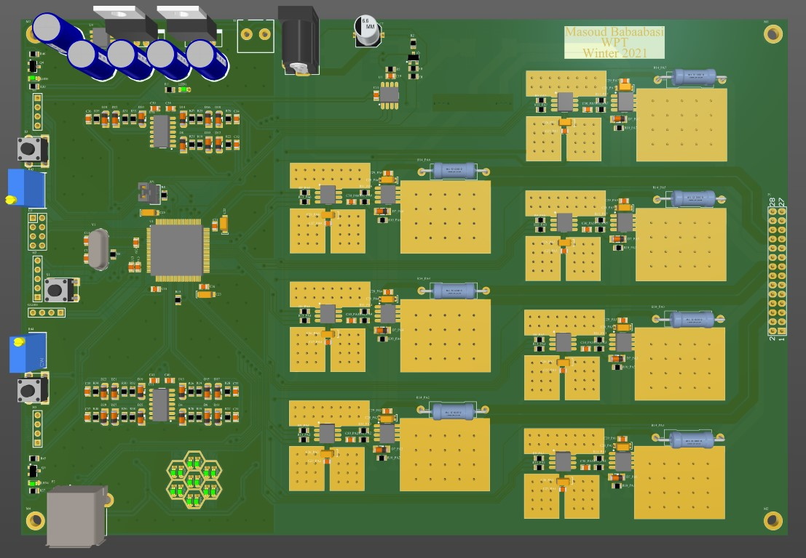
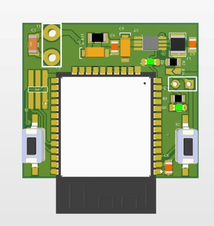
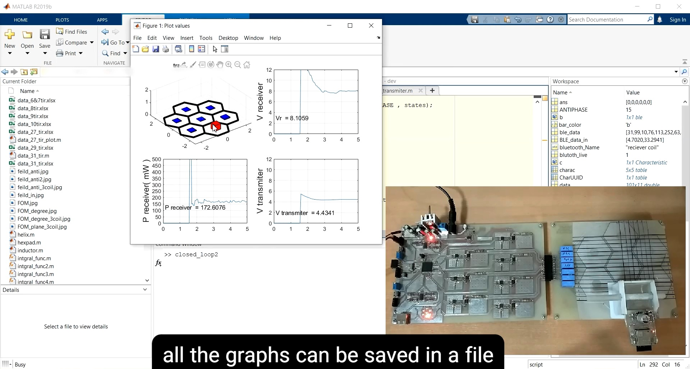

# A Wireless Power Transfer System
This is my master's degree project. The purpose of this project was to implement a wireless power transfer for a moving object for distances between 2 to 5 centimeters. This system also should compensate for angular misalignment in which the receiver coil plane has steep angles with the transmitting coils plane. All the coils for this project were implemented on PCB.
An array of 7 hexagon coils makes up the transmitting module. Each transmitter coil has a diameter of 5 centimeters and the receiver coil is a 3-centimeter square coil. For a better quality factor of the coils, the PCB coils are 2oz (70um) copper. 



Painting all the coils in Altium Designer by hand is exhausting and complicated and making changes is even harder. So to automate routing, I used the Altium scripting feature. In Altium, you can write code in [DelphiScript](https://www.altium.com/documentation/altium-designer/writing-scripts) (*.pas), which is basically Pascal language. The Altium scrip project is in the `PCBs/Coil_drawing_script` folder. I have written several functions that draw different kinds of coils in a PCB document. In the picture below you can see some output examples of this script. With this script changing the parameters of the PCB coil such as width, spacing, number of turns, and output diameter of the coils is done very easily. You can access the functions in the `coil_script.pas` file.
```pascal
Procedure PlacePCBObjects;
Var
 CCW : Integer;
 L :  Integer;
 H :  Integer;
 w :  Integer;
 N :  Integer;
 s :  Integer;
 dis  : Integer;
Begin
    (*create a new pcb document *)
    WorkSpace := GetWorkSpace;
    If WorkSpace = Nil Then Exit;
    Workspace.DM_CreateNewDocument('PCB');

    If PCBServer = Nil Then Exit;
    Board := PCBServer.GetCurrentPCBBoard;
    If Board = Nil then exit;
    dis := 60;
    (* Place new PCB objects*)
     coilSpiralCW(50 , 5 , 0.9 , 0.3, dis , dis,eTopLayer,1);
     coilSpiralCCW(50 , 15 , 1.2 , 0.25, dis * 2 ,dis,eBottomLayer,1);
     coilHexagonCW(50 , 21 , 1 , 0.35, dis  * 3,dis ,eTopLayer ,1);
     CCW := 0;
     coilNside(4, 50 ,15 , 1 , 0.35, dis  * 4,dis ,CCW,Pi/4,eTopLayer , 1);
     coilSpiral(15 ,10 , 1 , 0.35, 1 ,dis  * 5,dis ,CCW , 0 ,eTopLayer , 1);
     CCW := 1;
     coilNside(5, 50 ,15 , 1 , 0.35, dis  ,dis * 2 ,CCW,7*pi/10,eTopLayer , 1);
     L := 50;
     N := 8;
     w := 1;
     s := 0.35;
     H := ( L - ( w + s ))/2 ;
     coilRECT_CW(L , H , N , w , s , dis * 2 ,dis * 2 , 1, eTopLayer , 1);
     coilRECT_CW(L , H , N , w , s , dis * 2 ,dis * 2 + H  + w + s  , 4 ,eTopLayer , 1);

     coilRECT_CCW(H , L , N , w , s, dis * 2 - (H+w+s)/2 ,dis * 2 + (H+w+s)/2 , 2 ,eBottomLayer , 1);
     coilRECT_CCW(H , L , N , w , s, dis * 2 - (H+w+s)/2 + H  + w + s ,dis * 2 + (H+w+s)/2, 1 ,eBottomLayer , 1);
     
     L := 30;
     N := 3;
     w := 3;
     coilRECT_CW(L , L , N , w , s , dis * 3 ,dis * 2 , 1, eTopLayer , 1);

    (* Refresh PCB workspace *)
    ResetParameters;
    AddStringParameter('Action', 'All');
    RunProcess('PCB:Zoom');
End;
```



For driving the transmitter coils, 7 independent class D power amplifiers are implemented. The clock signals of these amplifiers are generated by an STM32F429 running at 180 MHz. Fourteen clock signals are produced and all of the amplifiers can be controlled independently.



On the receiver module, an ESP32 measures the voltage and current of the receiver circuit and transmits the data over Bluetooth Low Energy (BLE) to the transmitter module.



ALL the coding for the transmitter module STM32F429 is done in Keil IDE. Four timers are used and all of them are configured to be in a slave-master situation which guarantees the synchronization of the clock signal.

A closed-loop algorithm is developed in Matalb to control the transmitter module based on data received over BLE.

